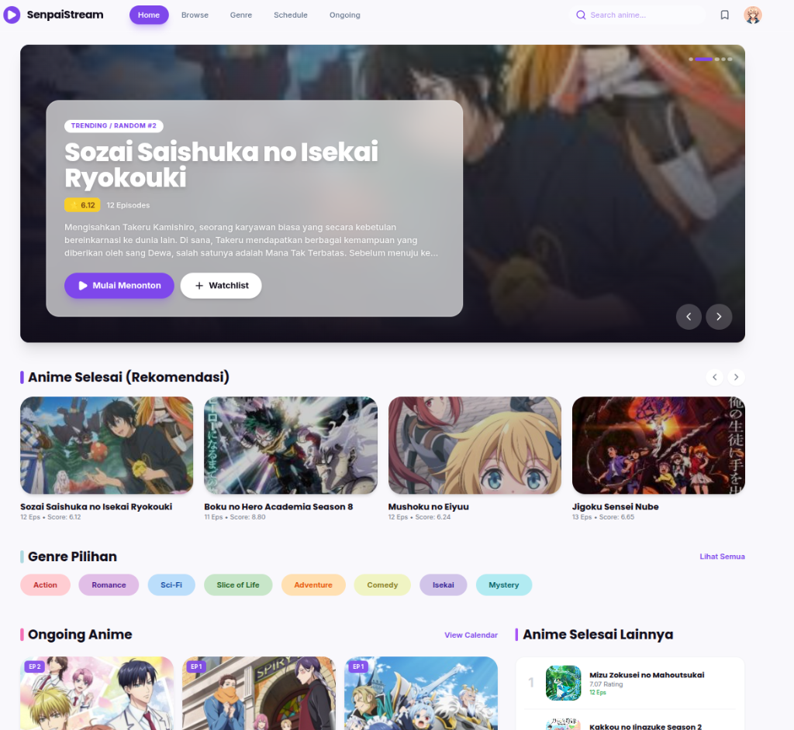
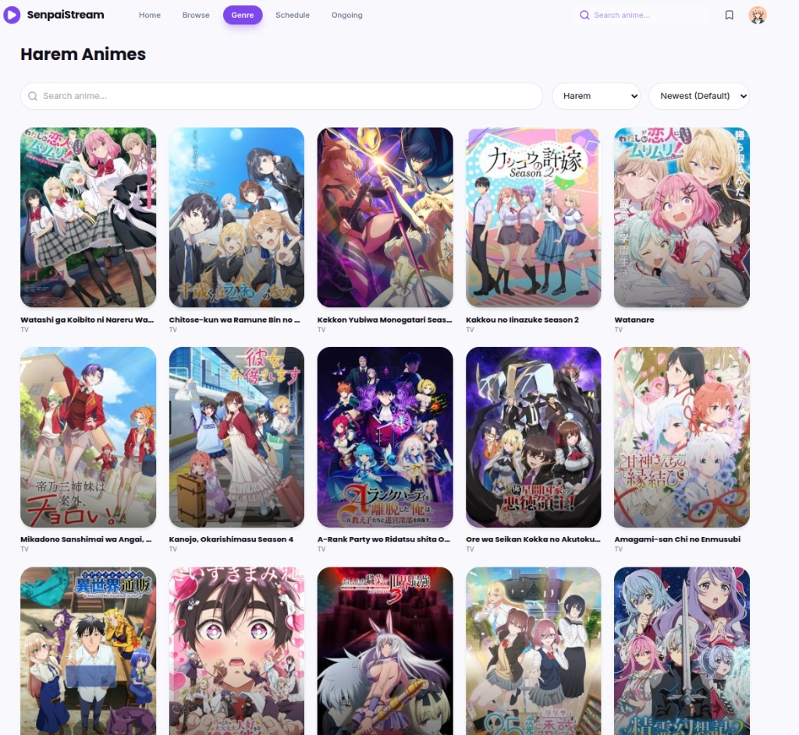
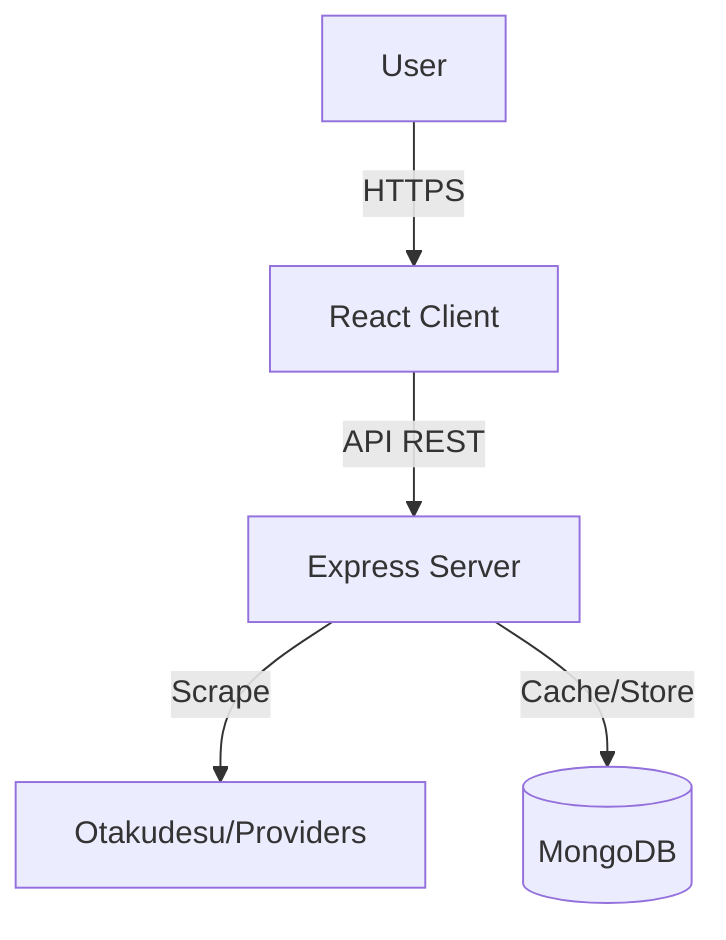

# 🌸 SenpaiStream

  

**SenpaiStream** is a premium, aesthetic anime streaming platform designed to provide a seamless and immersive viewing experience. Built with modern web technologies, it combines a glassmorphism-inspired UI with robust real-time scraping capabilities.



---

## ✨ Key Features

### 🎨 User Experience (UI/UX)
-   **Aesthetic Design**: Modern **Glassmorphism** interface with dynamic blurred backdrops and smooth transitions.
-   **Responsive Layout**: Fully optimized for Desktop, Tablet, and Mobile devices.
-   **Interactive Hero Section**: Cinematic carousel featuring trending anime with "aesthetic blur" ambiance.

### 🚀 Functionality
-   **Real-Time Data**: Content is scraped in real-time from external sources, ensuring zero delay in episode updates.
-   **Advanced Browsing**:
    -   **Global Search**: Fast search bar in Navbar and Browse page.
    -   **Genre Filtering**: Filter by 30+ categories (Action, Romance, Isekai, etc.).
    -   **Smart Sorting**: Sort by Newest, A-Z (Title), or Z-A.
-   **Defensive Pagination**: Robust fallback mechanisms ensure navigation never breaks, even with API hiccups.

### 🛠️ Technical Highlights
-   **Layered Cache Busting**: Prevents stale content issues using both client-side and server-side cache control.
-   **Docker Ready**: Full multi-stage build support for easy containerized deployment.
-   **Admin Panel**: Dedicated dashboard for server management.

---

## 📸 App Previews

### **Browse & Filtering**
Powerful filtering options allow users to find their favorite genre instantly.


---

## 🏛️ System Architecture



---

## 🚀 Getting Started

### Prerequisites
-   Node.js v18+
-   MongoDB (Local or Atlas)

### Local Installation

1.  **Clone the Repository**
    ```bash
    git clone https://github.com/your-username/animeweb.git
    cd animeweb
    ```

2.  **Install Dependencies**
    ```bash
    # Install Root/Backends
    cd backend && npm install
    
    # Install Frontend
    cd ../frontend && npm install
    ```

3.  **Run Development Server**
    ```bash
    # Terminal A (Backend)
    cd backend && npm run dev
    
    # Terminal B (Frontend)
    cd frontend && npm run dev
    ```

---

## 🐳 Self Hosting (Docker)

The application is designed to be easily self-hosted on any VPS or local server.

```bash
# 1. Build the image
docker build -t senpaistream .

# 2. Run container (Daemon/Background)
docker run -d \
  -p 5000:5000 \
  -e MONGO_URI="mongodb://host.docker.internal:27017/animeweb" \
  --name senpaistream \
  --restart always \
  senpaistream
```

Access your instance at `http://your-server-ip:5000`.

---

## 🤝 Contributing
Contributions are welcome! Please fork the repository and submit a pull request.

---
*Created with ❤️ by the SenpaiStream Team.*
